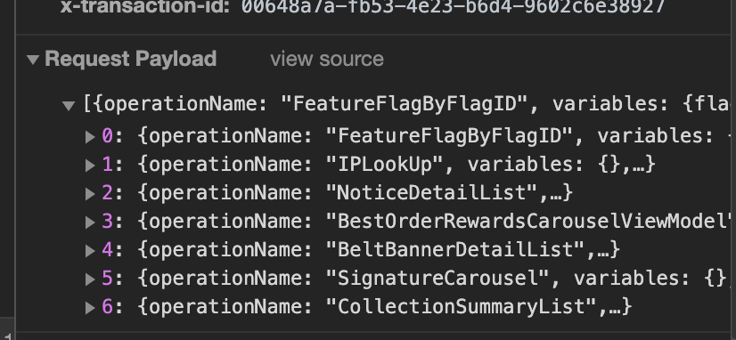

이왕이면 심부름도 한 번에 하면 좋잖아요?

# Overview

많은 앱 서비스들이 복잡한 요구사항들을 충족하려고 한 페이지 안에서도 많은 요청을 보냅니다. 하지만 규모가 커지면 이야기는 달라집니다. 수많은 요청이 한꺼번에 밀려오는 파도를 만났을 때, 이 난관을 어떻게 헤쳐나갈 수 있을까요?


수많은 Request 들..

클래스101 앱 서비스의 모든 클라이언트 요청은 GraphQL을 기반으로 이루어져 있습니다. GraphQL로 모든 요청을 계층화하고, 단일 요청으로 데이터를 Fetch한다면 꼭 필요한 데이터만 정의해서 받아올 수 있습니다. 하지만 리액트 환경에서 개발할 땐 조금 다릅니다. 컴포넌트의 계층을 나눠 캡슐화하고, 컴포넌트의 재사용성을 높이기 위해 데이터 Fetch 로직을 분할해 사용하는 컴포넌트와 함께 배치되도록 구성합니다.

이런 패턴은 널리 알려졌고 또 유용하지만, 오히려 한꺼번에 많은 요청이 들어온다면 각각의 요청으로 네트워크 연결이 많아질 뿐 아니라 오버헤드까지 발생하고, 더 나아가 예기치 못한 장애까지 생길 수 있습니다. 그렇다면 수많은 요청을 하나로 묶어 보내는 방법은 어떨까요? 네트워크의 왕복 비용을 줄일 수 있을 뿐만 아니라 효율적으로 Fetch를 할 수 있을 겁니다.

# Solution Plan

GraphQL 기반의 앱에서 Batch 처리는 크게 두 가지로 나뉩니다. 첫 번째는 하나의 Query Operation에 Alias를 이용해 여러 형태의 호출을 하나의 Query Operation으로 묶어 보낼 수 있다는 것입니다. 이 방법은 수동으로 Batch 작업을 해야 하기 때문에 클라이언트에서 코드가 복잡해지고, 쿼리의 추적도 어려워집니다. 또 경우에 따라 캐시와의 궁합도 나빠질 수 있습니다. 두 번째는 Apollo Server에 여러 Query Operation을 배열로 보내면, 한 번의 Request로 여러 쿼리를 Batch 처리하는 방법이 있습니다. 클래스101은 두 가지 방법을 모두 사용하고 있지만 오늘은 두 번째 방법을 소개하겠습니다.

# How to solve this problem?

apollo-link-batch-http(이하 Batch Link)는 클래스101에서 사용 중인 Apollo Client와 Integration 되어있는 Link 중 하나입니다.[1] 우선 아래와 같이 적용 전, 후 모습을 비교해서 Request Payload를 확인하면 확연한 차이가 보입니다. 


Batch Request 적용 전



Batch Request 적용 후

Batch Request 적용 전의 모습을 보면, Query Operation이 단건으로 요청합니다. 이와 다르게 Batch Request를 적용했을 때는 Query Operation이 배열로 변경되어 요청하는 걸 확인할 수 있습니다.


Batch Request 적용 전,후의 차이

다만 이 설명만으로는 마치 Batch Request가 네트워크 성능을 향상시키는 만능 솔루션처럼 보이겠지만 실제로는 그렇지 않습니다. 경우에 따라 클라이언트에서는 로딩 지연이 발생할 수도 있기 때문입니다. 예를 들어 각각 다른 컴포넌트에서 서로 다른 요청 10건을 보냈고 이 중 1건의 응답이 느려지면 클라이언트에서는 1건의 응답에 맞춰 모든 응답이 느려집니다. 이런 특성 때문에 어떤 특정 도메인이나 로직에 따라 응답 지연이 발생하면 클라이언트에서는 Batch 그룹에 따라 다른 컴포넌트에 영향이 갈 수도 있고, 가끔 디버깅이 어려워지는 일도 생깁니다. 그렇다면 Batch 링크를 어떻게 동작할 수 있을까요?

간단합니다. 요청 그룹을 하나의 요청으로 묶어서 다른 모든 쿼리에서 생성한 것과 동일한 데이터로 단일 요청을 만들면 됩니다. 요청 그룹으로 묶이는 경우는 임계치의 시간 동안 받은 모든 요청들을 하나의 그룹으로 묶는 방법이 있습니다. 예를 들어, 임계치가 100ms이라고 가정한다면, 컴포넌트에서 쿼리를 요청할 때 요청을 처리하지 않고 100ms 동안 기다립니다. 그리고 다른 요청들이 추가되었을 때 각각 따로 요청하지 않고 한 번의 요청으로 모든 요청을 동시에 처리합니다.

Batch Request를 적용하려면 Apollo Client에 Batch link를 연결합니다.

```bash
import { BatchHttpLink } from "apollo-link-batch-http";

const link = new BatchHttpLink({ uri: "/graphql" });

const client = new ApolloClient({
	// ...options
	link
});
```

이렇게 간단한 적용만으로 모든 GraphQL 요청은 하나의 Request로 묶여 요청할 것입니다. 다만 이런 적용만으로는 아직 해결해야 할 것이 남았습니다. 앞에서도 말했듯이 응답 시간이 오래 걸리는 쿼리는 사용하기 어렵기 때문입니다. 하나의 응답이 느려질 때 그룹의 모든 응답이 느려져 로딩 지연이 발생하는 현상을 해결하려면 느린(또는 무거운) 쿼리가 Batch 그룹에 포함되지 않도록 변경하면 됩니다.

```bash
import { BatchHttpLink } from "apollo-link-batch-http";
import { HttpLink } from 'apollo-link-http';
import { split } from 'apollo-link';

const batchLink = new BatchHttpLink({ uri: "/graphql" });
const httpLink = new HttpLink({ uri: "/graphq;" });
const link = split(
	operation => operation.getContext().single,
	httpLink,
	batchLink
);
```

split은 일종의 삼항 연산과 같습니다. 첫 번째 인자로 넘어온 함수가 true를 리턴하는 경우 두 번째 인자의 링크를, false의 경우 세번째 인자의 링크를 이용합니다. 아래의 첫 번째 함수를 보면 Operation에서 context의 single이라는 값을 참조합니다. 이것은 쿼리 요청 시 쿼리 컴포넌트에서 context에 single이라는 값을 넣으면 싱글 쿼리로 분리해 쿼리를 요청하겠다는 의미입니다. single 쿼리로 요청하면 해당 쿼리는 단일 쿼리로 요청을 보냅니다.

```bash
const { loading, error, data } = useQuery(QUERY, {
	context: { single: true },
	variables: {...variables}
});
```

# Conclusion

네트워크 성능과 관련된 다른 대안으로는 APQ(Apollo Persisted Query)를 이용하여 Request Body를 줄일 수도 있고, CDN 캐싱을 이용하여 엔드 포인트에 도달하지 않도록 구성할 수도 있습니다.

거의 모든 Batch 작업은 항상 복잡하고, 까다로운 문제를 유발하는 경우가 많습니다. 이 솔루션이 기존 시스템에 문제를 발생시킬 수도 있지만 기술은 각각의 상황에 맞게 사용할 수 있어야 하고, 경우에 따라서는 다른 솔루션을 선택할 수도 있어야 합니다. 적용하기 전에 Batch Request가 꼭 필요하거나 적절한 해결책인지 확인해야 합니다. 이번 글이 성능을 위한 방법을 결정해야 하거나, 의견을 제시할 때 자신감을 가지는 데에 도움이 되었길 바라겠습니다. 

# 참고문헌

[1] Batching Client GraphQL Queries, Apollo Blog, [https://www.apollographql.com/blog/batching-client-graphql-queries-a685f5bcd41b](https://www.apollographql.com/blog/batching-client-graphql-queries-a685f5bcd41b) 참조. (2020.06.23)
