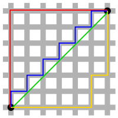
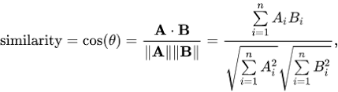
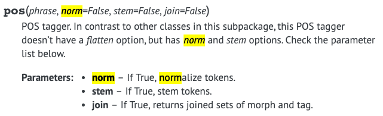

## Overview

Hello! I am Esmond who is responsible for operating recommendation server in CLASS101. Recently, we analyzed a similarity between classes using TF-IDF (Term Frequency – Inverse Document Frequency) and uploaded it as a form of API. Over two contents, I will write about the process of development and further plans. 

## Background and Object of Development

How can we classify hundreds of classes in CLASS101 application? Regarding this problem, largely we have two standards.

First, classify the classes by its category, which was given when the content was first made.
Second, classify the class by its collection, which is categorized by its title after opening is decided.

Lately, as CLASS101 is experiencing rapid growth, it seems inadequate to provide a simple recommendation such as category or collection. Since we need logic for a specific recommendation system, the development team decided to analyze an index, which is called ‘a similarity between classes’, and utilize the result. Our team aimed to realize three functions through this project.

- Store N unit of classes that show high similarity with all the classes
- Whenever a new class is added, automatically update the data 
- Open the service as API to easily asses at the application layer

## Assessing a measure of similarity for object quantifying

To assess the similarity between classes, we should know about various ways to measure the similarity scale. In this section, three measurements will be introduced: Euclidean Distance, Manhattan Distance, Cosine Similarity.

### Euclidean Distance

This is the most famous and simple way by measuring the distance between two vectors. In two dimension, it is so-called as ‘Pythagorean theorem’. Regarding two points p=(p1,p2,…,pn),q=(q1,q2,…,qn), the distance between two is calculated as below.


### Manhattan Distance

This measurement is called ‘Taxicab geometry’; it calculates the distance between one point to another in each coordinate divided into a square.



Regarding two points, p=(p1,p2,…,pn),q=(q1,q2,…,qn), the distance between two is calculated as below.


### Cosine Similarity

The purpose of this measurement is to calculate the similarity of vector direction instead of its size between two vectors in dot product space. A similarity increases as a direction between two vectors are similar. If two vectors have an entirely different direction (180’ angle), it will get cosine value of -1. Otherwise, if two vectors are in the same line (0’ angle), it will get a cosine value of 1. 



The similarity is calculated as below.

To apply those similarity measurements in the real field, it was required to have a process of quantifying the objects. TF-IDF, the vector space model, was utilized on this step. TF-IDF is a statistical value that shows the importance of a word appeared in a certain document. A word becomes crucial as its TF-IDF value goes up. The value is calculated by multiplying TF (a word frequency) and IDF (a reciprocal of document frequency). Briefly, it is measuring the similarity between classes through calculating the value after the vectorization of classes using TF-IDF values. <a href="#footnote-1">[1]</a>

## Development Process

The object named ‘class’ has several attributes such as a class title, class description, open due date, and creator. Firstly, we tried to measure the similarity using its title and description value, though it is best to reflect the entire attributes. We used the vectorization by TF-IDF and scikit-learn for utilizing relevant functions.

```python
pip install scikit-learn==0.21.1
```

About the sample sentence, let us do vectorization using TF-IDF, and measure the distance. 

```python
from sklearn.feature_extraction.text import TfidfVectorizer


doc_list = [
    '프리시즌 아시아 투어를 떠나는 토트넘은 싱가포르, 중국을 차례로 방문해 ICC 경기를 치른다.',
    '영국 "풋볼 런던"은 11일 "토트넘이 ICC 첫 경기에서 가장 강력한 스쿼드로 유벤투스에 맞설 것"이라고 평가했다.',
    '토트넘에 합류하는 손흥민은 유벤투스전 출전을 목표로 구슬땀을 흘릴 예정이다.',
]

tfidf_vectorizer = TfidfVectorizer(min_df=1)
tfidf_matrix = tfidf_vectorizer.fit_transform(doc_list)
doc_distances = (tfidf_matrix * tfidf_matrix.T)

print(doc_distances.toarray())
```

```
[[1.         0.04612956 0.        ]
    [0.04612956 1.         0.        ]
    [0.         0.         1.        ]]
```

1 means the similarity with its own. We can find that the similarity is not that high except the case, which the form of the sentence is almost similar. Then we will upgrade the similarity by extracting a certain word class (a noun) using a package like konlpy.

```python
pip install konlpy==0.5.1

from konlpy.tag import Okt


okt = Okt()

doc_nouns_list = [' '.join(okt.nouns(doc)) for doc in doc_list]
print(doc_nouns_list)

tfidf_vectorizer = TfidfVectorizer(min_df=1)
tfidf_matrix = tfidf_vectorizer.fit_transform(doc_nouns_list)
doc_nouns_distances = (tfidf_matrix * tfidf_matrix.T)

print(doc_nouns_distances.toarray())
```

```

[
    '프리 시즌 아시아 투어 토트넘 싱가포르 중국 차례 방문 경기',
    '영국 풋볼 런던 은 토트넘 첫 경기 가장 스 쿼드로 유벤투스 것 평가',
    '토트넘 합류 손흥민 유벤투스 전 출전 목표 구슬 땀 예정'
]

[[1.         0.11327504 0.04435806]
    [0.11327504 1.         0.12859167]
    [0.04435806 0.12859167 1.        ]]
```

According to the result, the similarity is measured more delicately than before. 
On this step, we will calculate the similarity between real class data. By selecting 10 classes in every 10 categories, a total of 100 sample classes are collected. After measuring the similarity between each class, we will look out for the category accordance ratio using the top 10 similar classes. From now on, we mention the class as ‘product’.

```python
{
    "product_id": PRODUCT_ID,
    "category_id": CATEGORY_ID,
    "title": "일러스트레이터 집시의 매력적인 얼굴 그리기",
    "description": "어떻게 그려도 예쁘고 멋진 비율과 비례, 매력과 생명력을 좌우하는 눈 코 입의..."
}
```

**TODO-LIST**
1. Make a new product dictionary by extracting nouns from ‘title’ and ‘description’.
2. Regarding ‘title’ and ‘description’, store the top 10 product id and distance value after vectorizing each attribute by TfidVectorizer and calculating the similarity.
3. Measure a similarity ratio between target class and category.
4. Using 100 sample data, measure a mean value of similarity ratio between target class and category.  
  


### Make a new product dictionary by extracting nouns from ‘title’ and ‘description’.

```python
from konlpy.tag import Okt
from tqdm import tqdm_notebook


okt = Okt()

def get_product_noun_list(product_list=None):
    return [{
        "product_id": product['product_id'],
        "category_id": product['category_id'],
        "title_noun": ' '.join(okt.nouns(product['title'])),
        "description_noun": ' '.join(okt.nouns(product['description'])),
    } for product in tqdm_notebook(product_list)]


product_noun_list = get_product_noun_list(product_list)
```


We look for the iteration by tdqm during the code is implemented in jupyter notebook environment. About 13.46 iterations per sec were recorded, and 7 seconds were spent for 100 data. Probably, it seems to take some time by implementing Java through Jpype since the core of konlpy is composed of Java. 

### Regarding ‘title’ and ‘description’, store the top 10 product id and distance value after vectorizing each attribute by TfidVectorizer and calculating the similarity.

```python
tfidf_vectorizer = TfidfVectorizer(min_df=1)

def get_similar_products(product_noun_list=None, field=None, top_n=None):
    output = []

    tfidf_matrix = tfidf_vectorizer.fit_transform([product[field] for product in product_noun_list])
    doc_distances = (tfidf_matrix * tfidf_matrix.T)

    for idx, distances in enumerate(doc_distances.toarray()):
        top_similar_product_indices = distances.argsort()[-(top_n+1):][::-1][1:]
        output.append({
            "product_id": product_noun_list[idx]['product_id'],
            "top_similar_products": [{
                    "product_id": product_noun_list[similar_idx]['product_id'],
                    "distance": round(distances[similar_idx], 6)
            } for similar_idx in top_similar_product_indices]
        })
    return output

title_similar_products = get_similar_products(product_noun_list, 'title_noun', 10)
description_similar_products = get_similar_products_new(product_noun_list, 'title_noun', 10)

print(title_similar_products[0])
```

```
{
    'product_id': 'xxxxx',
    'top_similar_products': [
        {'product_id': 'xxxx', 'distance': 0.280641},
        {'product_id': 'xxxx', 'distance': 0.182949},
        {'product_id': 'xxxx', 'distance': 0.180826},
        {'product_id': 'xxxx', 'distance': 0.156225},
        {'product_id': 'xxxx', 'distance': 0.137592}
    ]
}
```

The entire product id is marked as xxxx.
 
### Measure a similarity ratio between target class and category.

```python
CATEGORY_DICT = {}
for product in (product_list):
    CATEGORY_DICT[product['product_id']] = product['category_id']

def get_ratio_list_of_same_category(similar_products=None):
    ratio_list_of_same_category = []
    for target_product in similar_products:
        category_of_target_product = CATEGORY_DICT[target_product['product_id']]
        category_list = [CATEGORY_DICT[product['product_id']] for product in target_product['top_similar_products']]

        same_category_ratio = category_list.count(category_of_target_product) / len(category_list)
        ratio_list_of_same_category.append({
            "product_id": target_product["product_id"],
            "same_category_ratio": same_category_ratio
        })
    return ratio_list_of_same_category

title_ratio_list_of_same_category = get_ratio_list_of_same_category(title_similar_products)
desc_ratio_list_of_same_category = get_ratio_list_of_same_category(description_similar_products)

print(title_ratio_list_of_same_category[0])
```

```
[
    {'product_id': 'xxxx', 'same_category_ratio': 0.3},
    {'product_id': 'xxxx', 'same_category_ratio': 0.2},
    {'product_id': 'xxxx', 'same_category_ratio': 0.4},
    {'product_id': 'xxxx', 'same_category_ratio': 0.6},
    {'product_id': 'xxxx', 'same_category_ratio': 0.4},
    ...
]
```

### Using 100 sample data, measure a mean value of similarity ratio between target class and category.  

```python
def get_avaerage_of_ratio(ratio_list_of_same_category=None):
    ratio_list = [dc['same_category_ratio'] for dc in ratio_list_of_same_category]
    return sum(ratio_list) / len(ratio_list)

title_avaerage_of_ratio = get_avaerage_of_ratio(title_ratio_list_of_same_category)
desc_avaerage_of_ratio = get_avaerage_of_ratio(desc_ratio_list_of_same_category)

print(f"title 기준 타겟 클래스와 카테고리가 일치하는 비율의 평균: {round(title_avaerage_of_ratio, 5)}")
print(f"description 기준 타겟 클래스와 카테고리가 일치하는 비율의 평균: {round(desc_avaerage_of_ratio, 5)}")
```

```
The mean value of accordance ratio between a target class and category using its ‘title’: 0.224
The mean value of accordance ratio between a target class and category using its ‘description’: 0.425
```


## Conclusion

In this content, we did several analysis from class clustering based on the existing category to similarity test based on class title and description. On next section, I will introduce a way to store the similar classes on DB and distribution process of recommendation server that constantly provides API, which does not need to restart the server as a new class is updated.

## References

(a) Konply’s Okt (Twitter in the past) can use the token normalization function at pos tagging, unlike other classes.



**dissertation and academic data**

<span id="footnote-1">[1]</span> Sasiporn Tongman ・ Niwan Wattanakitrungroj, <Classifying Positive or Negative Text Using Features Based on Opinion Words and Term Frequency - Inverse Document Frequency>, 5th International Conference on Advanced Informatics: Concept Theory and Applications (ICAICTA), 2018, p.161.

**websites**

- Euclidean distance, Wikipedia, [https:// en.wikipedia.org/wiki/Euclidean_distance](https://en.wikipedia.org/wiki/Euclidean_distance) 참조. (2019.07.12)
- Taxicab geometry, Wikipedia, [https:// en.wikipedia.org/wiki/Taxicab_geometry](https://en.wikipedia.org/wiki/Taxicab_geometry) 참조. (2019.07.12)
- Cosine similarity, Wikipedia, [https:// en.wikipedia.org/wiki/Cosine_similarity](https://en.wikipedia.org/wiki/Cosine_similarity) 참조. (2019.07.12)
- TF-IDF, Wikipedia, [https:// en.wikipedia.org/wiki/Tf–idf](https://en.wikipedia.org/wiki/Tf%E2%80%93idf) 참조. (2019.07.12)
- Okt class, KoNLPy, [http:// konlpy.org/en/latest/api/konlpy.tag/](http://konlpy.org/en/latest/api/konlpy.tag/) 참조. (2019.07.12)
