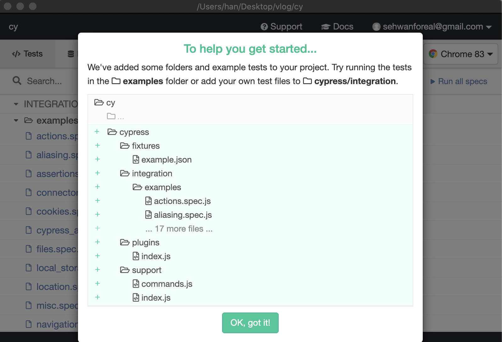
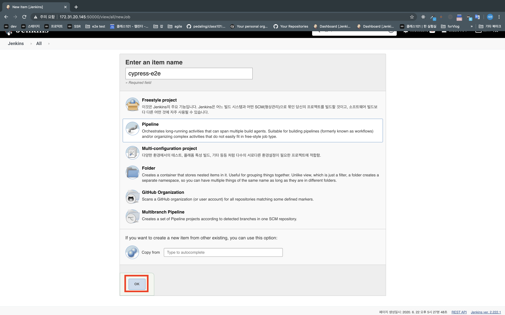
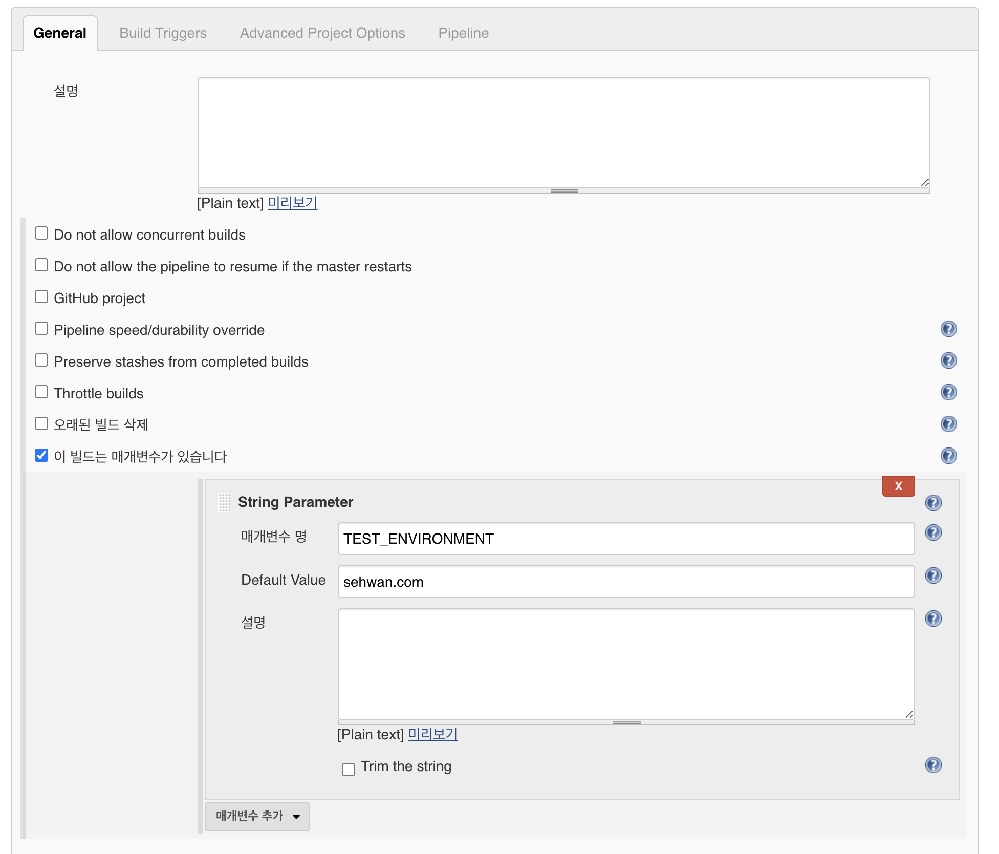
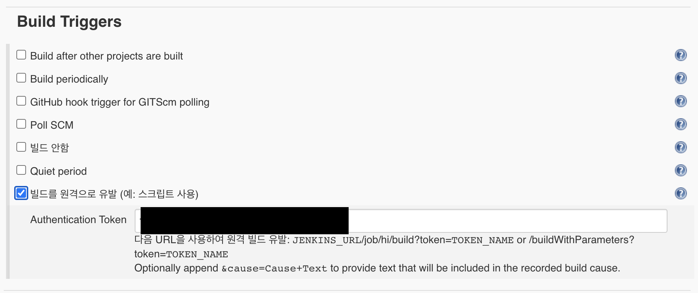
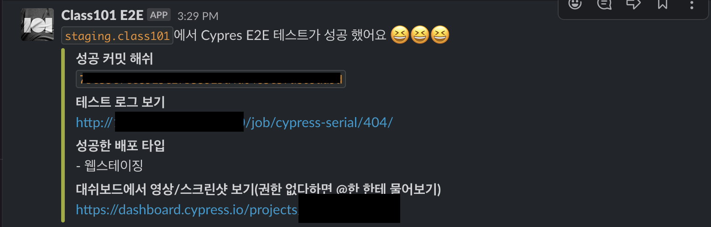
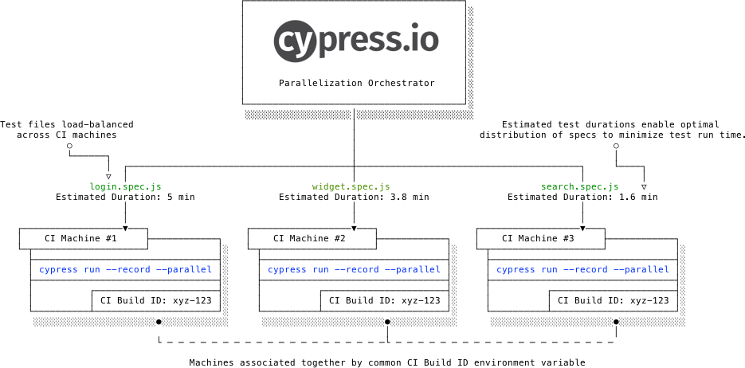
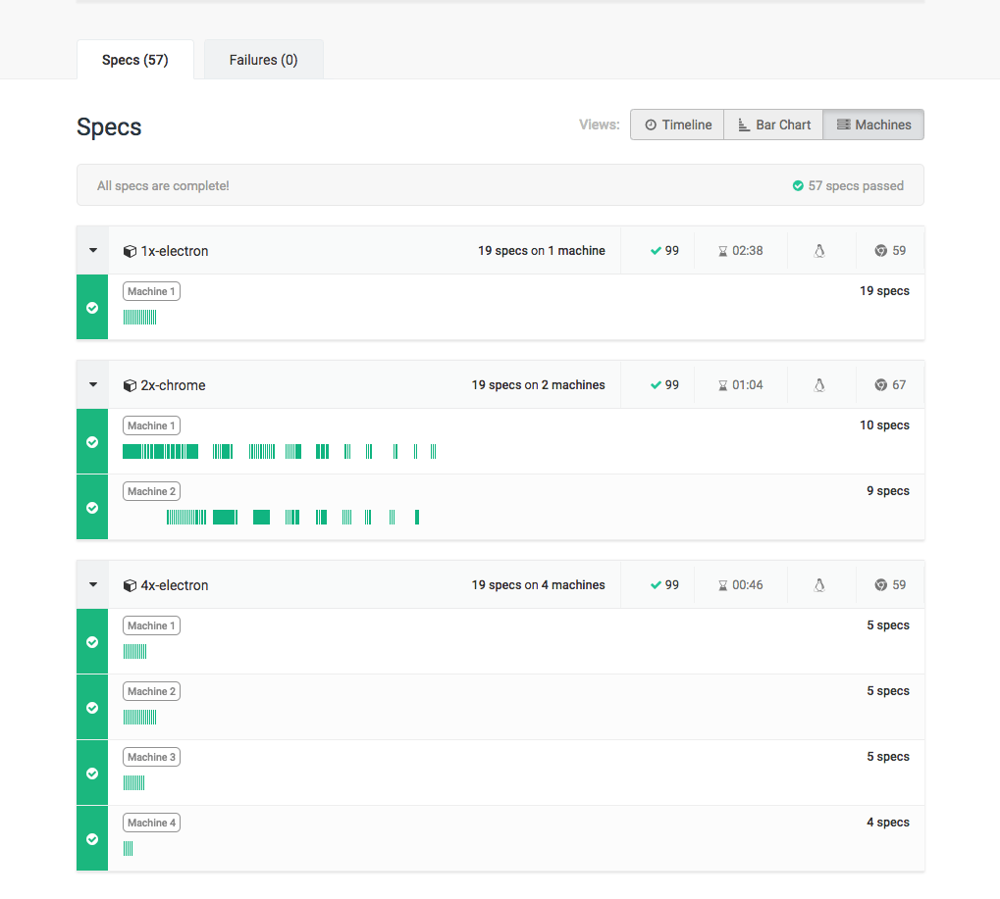

클래스101 서비스가 날마다 크고 있는만큼 코드의 규모도 커졌고, 그에 따라서 버그 발생확률도 높아졌습니다. 서비스 규모가 작을 땐 담당자가 직접 UI를 테스트하는 등 기존의 QA 프로세스로도 충분했지만 이제는 작업 범위와 시간이 많이 소요되기 때문에 더욱 체계적이고 새로운 프로세스가 필요해졌습니다.

소프트웨어 테스트에는 유닛 테스트, 통합 테스트 등 여러 방법이 있지만 유저와 최대한 비슷한 환경에서 테스트를 진행하는 E2E 테스트를 구축하기로 했습니다. 특히 안정성과 성능을 고려해 널리 쓰이고 있는 Cypress를 E2E 테스트 툴로 선정했죠.

**참고: 테스트 필수사항**

- 클래스101의 모든 코드는 TypeScript 기반으로 작성되어 있다. 하지만 앞으로의 유지보수와 확장성을 고려해 기본언어인 JavaScript가 아닌 TypeScript로 테스트 코드를 작성한다.
- 서비스에서 가장 중요한 기능인 결제와 유저 인증, 클래스 수강을 필수적으로 테스트한다.

### Action Plan

1. **Requirements**
   - Docker가 가동 가능한 Jenkins
   - 테스트 코드가있는 Cypress 레파지토리
   - node.js 등의 필수개발환경
   - TypeScript

**2. Goals**

1. 결제 기능에 버그가 생기면 비즈니스에 치명적이므로 관련 기능을 지속적으로 테스트한다.

2. github 에서의 PR 등을 Webhook Trigger를 이용하면 테스트가 자동으로 가동된다.

3. 기존의 배포체계와 연동해 배포가 끝날 때마다 테스트가 가동된다.

4. 누구든 원할 때마다 쉽게 테스트를 시작할 수 있다.

5. 테스트가 실패했을때 효율적으로 대응하기 위해 Slack과 같은 커뮤니케이션 툴과 연동한다.

6. Javascript가 아닌 Typescript로 테스트 코드를 작성한다.

**3. Bonus Goals**

1. 테스트를 병렬로 처리해 소요 시간을 최소화한다.

2. PR때마다 로컬 환경에서 테스트를 가동한다.

3. 기존 Kubernetes에 올려 관리하고, CronJob으로 짧은 간격을 두고 지속적으로 가동한다.

**4. Expected Outcome**

1. 상용에 배포하기 전, 테스트에서 버그를 찾아 유저 경험을 개선시킨다.

2. 결제 페이지에서 버그를 찾아 매출 손실을 줄인다.

3. QA담당자가 UI에서 테스트하는 리소스를 최소화한다.

### Implementation 1 : Implementing test specs

**1. Installing Cypress**

테스트의 목표가 되는 프로젝트 레파지토리에 Cypress를 설치하는 것을 권장하지만, 당시 팀의 상황으로 따로 분리해서 레파지토리를 생성했습니다. 우선 npm 또는 yarn으로 Cypress를 설치합니다.

```bash
yarn add -D cypress

```

설치가 끝난후, 기본 설정을 위해 Cypress를 오픈합니다.

```bash
yarn cypress open

```

Cypress를 오픈하면, 친절하게도 예시 테스트 코드들이 생성됩니다.



**2. Setup Typescript**

@types/node를 설치합니다.

```bash
yarn add -D @types/node

```

tsconfig을 설정합니다.

```tsx
// tsconfig.json

{
  "compilerOptions": {
    "strict": true,
    "baseUrl": ".",
    "target": "ESNext",
    "lib": ["es6", "dom"],
    "module": "commonjs",
    "incremental": true,
    "types": ["cypress"],
  },
  "include": ["**/*.ts"]
}

```

TypeScript를 사용하기 위해 ts-loader를 설정합니다.

```jsx
// cypress/plugins/index.js

const wp = require('@cypress/webpack-preprocessor');

module.exports = on => {
  const options = {
    webpackOptions: {
      resolve: {
        extensions: ['.ts', '.tsx', '.js']
      },
      module: {
        rules: [
          {
            test: /\\.tsx?$/,
            loader: 'ts-loader',
            options: { transpileOnly: true }
          }
        ]
      }
    }
  };
  on('file:preprocessor', wp(options));
};
```

Xpath로 DOM을 셀렉트 할 수 있게 하는 라이브러리인 Cypress-Xpath를 Typescript 환경에서도 사용하기 위해 인터페이스를 타이핑합니다.

```tsx
// cypress/support/index.d.ts
// <reference types="cypress" />

declare namespace Cypress {
  interface Chainable<Subject> extends Cypress.Chainable {
    xpath<E extends Node = HTMLElement>(
      selector: string,
      options?: Partial<Loggable & Timeoutable>
    ): Chainable<JQuery<E>>;
  }
}
```

**3. Writing Test Codes**

테스트 코드를 작성하는 건 Cypress 공식 문서에 많은 예시와 함께 설명이 잘 되어있습니다. 기존의 JEST 같은 자바스크립트 기반의 테스팅 프레임워크와 API의 패턴이 거의 같기 때문에 이 과정은 생략하겠습니다.

작성할 때 다른 코드들과 같이 중복되는 여러 함수들을 추상화하여 유틸 함수로 사용할 수 있습니다. 이번 프로젝트에서는 테스트 목표가 되는 DOM의 attribute 들이 단일성이 부족하고 복잡하기 때문에 셀렉트에 관련한 유틸 함수들을 여럿 생성하겠습니다.

```tsx
// cypress/utils/dom/index.ts

export const getByTestId = (value: string) => getBy('data-test-id', value);

export const getByClassName = (value: string) => cy.get(`[class*="${value}"]`);

export const getByName = (value: string) => cy.get(`[name="${value}"]`);

export const getByXpath = (value: string) => cy.xpath(value);
```

1)**support 파일**

테스트하는 제품에서 기능적인 문제가 없어도 써드파티 앱이나 당장 고치기 힘든 소스 코드의 문제로 type error 혹은 http 에러가 표시될 때, Cypress 는 이것을 에러로 인식해 테스트가 실패할 수도 있습니다. 이런 문제들을 예외 처리하려면 Cypress.on 함수를 사용하면 됩니다.

```tsx
// cypress/support/index.ts

Cypress.on('uncaught:exception', () => {
  return false;
});
```

또한 node 모듈을 import할 땐 파일마다 작성하지 않고, support파일에서 공통적으로 import할 수도 있습니다.

```tsx
// cypress/support/index.ts

import 'cypress-file-upload';
import 'cypress-xpath';
import './commands';

Cypress.on('uncaught:exception', () => {
  return false;
});
```

2)**유저 인증처리**

웹, 앱 서비스를 테스트하려면 유저인증, 로그아웃, 회원가입의 기능들을 필수적으로 테스트되고, 또 테스트 과정에 중복으로도 포함될 수 있습니다. 로그인, 회원가입 등을 Cypress에서 요청을 보내 수행할 수 있는 것 같았지만, 최대한 유저와 같은 환경에서 테스트하는 것이 핵심이기 때문에 UI에서 처리하도록 코드를 작성합니다. 이는 여러 테스트 파일에서 불릴 수 있기 때문에 추상화해서 미리 util 함수로 빼둡니다.

```tsx
// cypress/utils/action/index.ts

export const login = (accessID: string, accessPassword: string): void => {
  cy.visit('/login')
    .get('[type=email]')
    .type(accessID)
    .should('have.value', accessID)
    .get('[type=password]')
    .type(accessPassword)
    .get(`[type=submit]`)
    .click();
};
```

테스트를 진행하다보면 각각의 테스트마다 의존성을 없애야 합니다. 테스트마다 유저정보를 초기화하는 과정이 필요했습니다. 당시 테스트 목표 웹은 firebase로 인증 처리를 해서 indexedDB에 토큰을 저장하는 방식이었습니다. 이를 초기화하기 위해 테스트 시작할 때마다 비워주는 함수를 이용했습니다.

```tsx
// cypress/integration/sometest.spec.ts

context('회원가입후 뭔가를 한다', (): void => {
  Cypress.on('window:before:load', (win): void => {
    win.indexedDB.deleteDatabase('firebaseLocalStorageDb');
  }); // indexedDB 초기화시켜 로그인 상태일시  로그아웃

  it('회원가입을 한다', (): void => {
    // 회원가입 함
  });
});
```

3)**조건부 테스팅**

테스트 목표 웹은 CRM 부서에서 braze등의 써드파티 앱을 사용해 모달등을 띄우는 작업을 진행했는데, 이 때문에 랜덤한 DOM 노드가 생겨 테스트가 실패로 끝나는 경우가 발생했습니다. 이런 문제를 방지하기 위해 조건문을 활용해 `모달이 발견될시 -> 모달을닫는다` 라는 동작을 하는 함수를 추가했습니다.

```tsx
// cypress/integration/sometest.spec.ts

context('뭔가 테스트한다', (): void => {
  it('모달이뜰수도있는 페이지를 테스트한다', (): void => {
    // 테스트 진행
		// 모달이 뜨는시점에왔다
		.get('body')
		.then(($body) => {
        if ($body.find('[data-test-id=modal-page-blocker]').length) {
          cy.wait(1000);
          cy.get('body').click('top');
        }
      })
		// 테스트 계속 진행
  });

});

```

### Implementation 2 : Running on Jenkins

테스트 코드가 어느정도 자리를 잡으면 자동화를 위해 젠킨스와 연동합니다.

**1. Setting up Jenkins Pipeline**

Docker와 Shell 스크립트 사용이 용이한 Pipeline으로 아이템을 생성하고 'OK' 버튼을 클릭합니다.



환경변수를 설정하여 원할 때마다 테스트 환경을 조정할 수 있도록 합니다. 이렇게 하면 Pipeline에서 Cypress의 config까지 설정할 수 있습니다.



Build Triggers 를 설정합니다. http요청을 받게 되면 테스트가 가동됩니다. Authentication token은 젠킨스 user에서 설정할 수 있습니다.



해당 curl 요청을 보내면 테스트 시작을 트리거합니다.

```bash
curl --location --request POST 'http://(젠킨스-주소)/job/(cypress-job-이름)/buildWithParameters?token=(위의AuthToken)&(환경변수1-key)=(환경변수1-value)&(환경변수2-key)=(환경변수2-value)'

```

**참고: Pipeline 코드 작성**

Docker 없이 Cypress를 실행해봤지만 의존성 항목들이 젠킨스 호스트에 포함되지 않아, 정상적으로 작동되지 않았습니다. 이때 Cypress가 가동되는데 필요한 시스템 라이브러리들과, 크롬 브라우저가 포함된 공식 이미지가 제공되기 때문에 해당 이미지를 사용하도록 합니다.

**agent**

- docker등의 환경을 설정한다. 이미지는 Cypress에서 제공하는 최신 이미지로 설정한다.

**enviroment**

- jenkins의 환경 변수들을 사용하게 한다.

**stages**

stage('clone')

- git 레파지토리에서 jenkins 환경으로 클론한다. credentials 설정이 필요하다.

stage('install')

- node 모듈들을 설치한다.

stage('cypress run')

- cypress 테스트를 가동한다.

  `--config`

  - baseUrl, viewport 등의 일반적인 지정된 설정값을 설정할 수 있다. 코드 상에서 `Cypress.config('baseUrl')` 처럼 접근할 수 있다.

  `--env`

  - Cypress자체의 env를 설정할 수 있다. config과 같이 코드 상에서 `Cypress.env('adminID')` 처럼 접근할 수 있다.

```groovy
pipeline {
  agent {
    docker {
        image 'cypress/browsers:node12.13.0-chrome80-ff74'
        args '--ipc="host"'
    }
  }
  environment {
    HOME = "${env.WORKSPACE}"
  }

  stages {
        stage('clone') {
            steps {
            git credentialsId: 'e2e-cypress-key', url: 'git@github.com:sehwanjjang/cypress.git'
            }
        }
        stage('install') {
            steps {
            sh 'npm install'
            }
        }

        stage('cypress run') {
            steps {
            echo "Running build ${env.BUILD_ID}"
            sh "\\$(npm bin)/cypress run --config baseUrl=https://${TEST_ENVIRONMENT} --env CardTestID=card125123,BankTestID=bank215123,"
            }

        }
  }
}

```

**2. Slack Integration**

Cypress dashboard를 이용해 Slack과 연동하는 방법이 있었지만, 이번 글에서는 Slack의 incoming webhook API 와 curl을 활용해서 Slack의 지정된 채널에 테스트 결과를 전송하겠습니다.

failure{} 문법을 활용해 실패했을 때의 메세지와, 성공했을 때의 메세지를 서로 다르게 curl로 전송합니다.

```groovy
pipeline {
  agent {
    docker {
        image 'cypress/browsers:node12.13.0-chrome80-ff74'
        args '--ipc="host"'
    }
  }
  environment {
    HOME = "${env.WORKSPACE}"
  }

  stages {
        stage('clone') {
            steps {
           git credentialsId: 'e2e-cypress-key', url: 'git@github.com:sehwanjjang/cypress.git'
            }
        }
        stage('install') {
            steps {
            sh 'npm install'
            }
        }

        stage('cypress run') {
            steps {
            echo "Running build ${env.BUILD_ID}"
            sh "\\$(npm bin)/cypress run --config baseUrl=https://${TEST_ENVIRONMENT} --env CardTestID=card125123,BankTestID=bank215123,"
            }
        post {
                failure {
                    echo "post log to slack"
                            sh label: '', script: '''
                            curl --location --request POST \\'<https://hooks.slack.com/services/webhook주소\\>' \\\\
                            --header \\'Content-Type: application/json\\' \\\\
                            --data-raw \\'{
                                "text": " `\\'"${TEST_ENVIRONMENT}"\\'`에서 Cypress E2E 테스트가 실패했어요 <@U01129G3N3Z> 콘솔을 확인해주세요 😭😭😭",
                                "attachments": [
                                    {
                                        "color": "#f04f98",
                                        "fields": [
                                            {
                                                "title": "실패 커밋 해쉬",
                                                "value": "`\\'"${COMMIT_HASH}"\\'`",
                                            },
                                            {
                                                "title": "테스트 로그 보기(vpn 필요)",
                                                "value": "\\'"${BUILD_URL}"\\'console",
                                            },
                                            {
                                                "title": "실패한 배포 타입",
                                                "value": "- \\'"${DEPLOY_TYPE}"\\'",
                                            },
                                            {
                                                "title": "대쉬보드에서 영상/스크린샷 보기(권한 없다하면 @한 한테 물어보기)",
                                                "value": "<https://dashboard.cypress.io/projects/-/runs>",
                                            }
                                        ]
                                    }
                                ]
                            }\\'
                            '''
                    }
                }
        }

        stage('slack noti') {
            steps {
            echo "post log to slack"
            sh label: '', script: '''

            curl --location --request POST \\'<https://hooks.slack.com/services/webhook주소\\>' \\\\
            --header \\'Content-Type: application/json\\' \\\\
            --data-raw \\'{
                "text": "`\\'"${TEST_ENVIRONMENT}"\\'`에서 Cypres E2E 테스트가 성공 했어요 😆😆😆",
                "attachments": [
                    {
                        "color": "#9ead31",
                        "fields": [
                                            {
                                                "title": "성공 커밋 해쉬",
                                                "value": "`\\'"${COMMIT_HASH}"\\'`",
                                            },
                                            {
                                                "title": "테스트 로그 보기",
                                                "value": "\\'"${BUILD_URL}"\\'",
                                            },
                                            {
                                                "title": "성공한 배포 타입",
                                                "value": "- \\'"${DEPLOY_TYPE}"\\'",
                                            },
                                            {
                                                "title": "대쉬보드에서 영상/스크린샷 보기(권한 없다하면 @한 한테 물어보기)",
                                                "value": "<https://dashboard.cypress.io/projects/-/runs>",
                                            }
                        ]
                    }
                ]
            }\\''''
        }
        }
  }
}

```

테스트가 끝났을 때, 아래 사진처럼 테스트 결과를 받을 수 있습니다.



### Implementation 3 : Parallelization(DashBoard)



Cypress는 젠킨스와 같은 CI 머신에서 가동될 때, 병렬화 기능을 제공합니다. 병렬화 기능은 유료 서비스인 Dashboard 서비스와 연동했을때만 가능합니다.[1]

`--record` flag와 함께 `--key=asdf1234` 과 같이 record key를 넣어줍니다. 마지막으로 `--parallel` flag를 넣으면 간단하게 병렬화 설정이 끝납니다.

```groovy
stage('cypress parallel tests') {
  parallel {
   stage('machine A') {
    steps {
     sh "\\$(npm bin)/cypress run --record --key=asdf123 --parallel --config baseUrl=https://${TEST_ENVIRONMENT} --env CardTestID=card125123,BankTestID=bank215123,"
    }
   }
   stage('machine B') {
    steps {
     sh "\\$(npm bin)/cypress run --record --key=asdf123 --parallel --config baseUrl=https://${TEST_ENVIRONMENT} --env CardTestID=card125123,BankTestID=bank215123,"
    }
   }
  }
 }

```

설정을 마치면 Cypress의 자체 balancing 알고리즘으로 테스트 파일을 분산해서 병렬적으로 테스트가 가동됩니다. 여기에서 테스트들의 파일을 맥락별로 나눠, 임의의 그룹으로 지정할 수도 있습니다.

```bash
cypress run --record --group package/admin --spec 'cypress/integration/packages/admin/**/*'

```

테스트가 끝나고 Dashboard에 접속하면 이와 같이 테스트 결과와 함께 가동된 가상 머신들을 볼 수 있습니다.



### Conclusions

**1. Benefits of Cypress testing environment**

TDD등과 같은 테스트 관련 방법론이 나오면서 테스트의 필요성과 중요도는 더욱 높아지고 있습니다. 그에 따른 기술들도 하루가 다르게 다양해지고 있기도 합니다. 웹 서비스의 경우, 유닛 테스트와 E2E 테스트 기법으로 서로의 장단점을 보완한다면 결과적으로 개발자의 개발 안정성과, 서비스의 신뢰도, 유저경험 개편에 큰 기여를 할 것으로 보입니다.

**2. How are we using Cypress**

클래스101에서는 위 내용들을 바탕으로 QA 프로세스를 구축했고, 기존의 배포 프로세스에 포함해 매일 약 10번의 테스트가 가동되고 있습니다. 실제로 도입한 이후엔 발견하지 못했던 버그를 Cypress테스트에서 잡아내는 성과가 생기고 있습니다. 특히 비즈니스와 밀접한 연관이 있는 결제 기능에서 버그가 발생하는 상황을 여러 번 방지할 수 있었습니다.

다만 유닛 테스트와 달리 코드를 변경하거나 웹의 DOM 속성이 변경되면 테스트 전에 이를 반영해야 하기 때문에 테스트 코드를 유지보수하는 데에도 지속적인 리소스가 소모됩니다.

**3. About development**

테스트 코드를 작성하는 것은 생각보다 간단했습니다. 테스트 코드의 세부적인 점을 손보는 것보단 테스트가 안정적으로 가동되는 환경을 구축하는 것에 초점을 두었습니다. 하지만 테스트가 많아질수록 시간이 늘어날 수밖에 없었기 때문에 시간 단축보단 유저와 비슷한 환경에서 테스트가 가동되는 것에 집중했습니다.

### 참고문헌

[1]Dashboard Projects, Cypress, [https://docs.cypress.io/guides/dashboard/projects.html#Setup](https://docs.cypress.io/guides/dashboard/projects.html#Setup) 참고. (2020.06.24)

**기타 사이트**

- What Is End To End Testing: E2E Testing Framework With Examples, Software Testing Help, [https://www.softwaretestinghelp.com/what-is-end-to-end-testing/](https://www.softwaretestinghelp.com/what-is-end-to-end-testing/)
- Why Cypress?, Cypress, [https://docs.cypress.io/](https://docs.cypress.io/)
- cypress-io, GitHub, [https://github.com/cypress-io/cypress-example-kitchensink/blob/master/Jenkinsfile](https://github.com/cypress-io/cypress-example-kitchensink/blob/master/Jenkinsfile)
